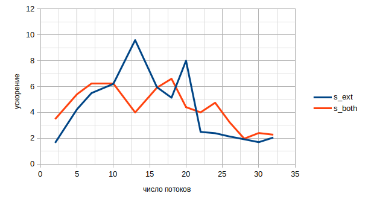
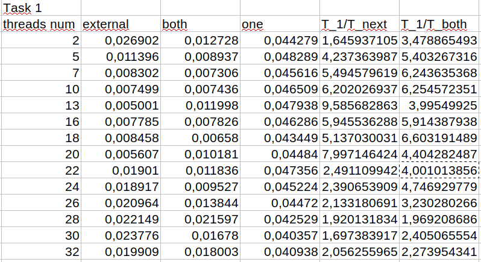
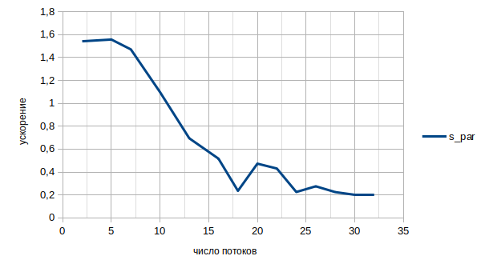
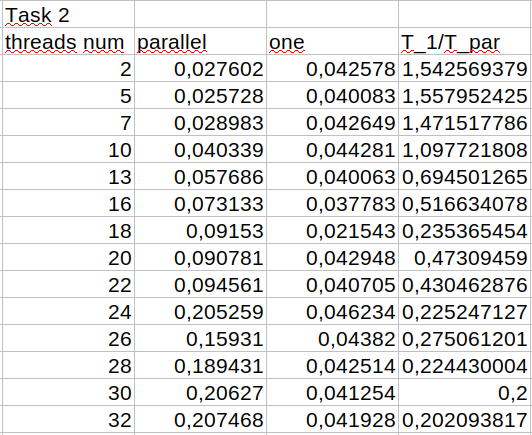

### Лабораторная работа

## Основное задание
Распараллелить с помощью MPI
```c
    #define ISIZE 1000
    #define JSIZE 1000
```
```c
for (i = 0; i < ISIZE; i++) {
  for (j = 0; j < JSIZE; j++) {
     a[i][j] = 10 * i + j;
  }
}
for (int i = 0; i < ISIZE; i++) {
	for (int j = 0; j < JSIZE; j++) {
	    a[i][j] = sin(0.00001 * a[i][j]) ;
	}
}
```
Так как D(0, 0) = ("=","="), то можно распараллелить как по внешнему циклу, так и по внутреннему.
В данном репозитории первый и второй цикл свернуты в один, тк более рациональнее.
Параллелизация реализована для внешнего цикла и для обоих сразу.
```c
typedef struct
{
size_t isBoth;
size_t block_size;
size_t mod;
void (*ptr_work_fun)(double* , size_t, size_t);
} run_params; - параметры запуска, зависят от типа параллелизации

void run(int rank, int size, double* a, run_params params); - распределяет задачи между потоками и собирает данные
void work_ext(double* a, size_t start, size_t end); - для распараллеливания внешнего цикла
void work_both(double* a, size_t start, size_t end); - для распараллеливания внешнего и внутреннего циклов
```





## Задание 2а
Распараллелить с помощью MPI
```c
for (int i = 0; i < ISIZE; i++) {
    for (int j = 0; j < JSIZE; j++) {
    a[i][j] = 10 * i + j;
    }
}
for (int i = 0; i < ISIZE - 1; i++) {
    for (int j = 1; j < JSIZE; j++) {
    a[i][j] = sin(0.00001 * a[i + 1][j - 1]);
    }
}
```
Для второй группы вложенных циклов D(-1, 1) = (">", "<"), внешний цикл может быть распараллелен без ограничений.
Для внутреннего цикла d = 1 > 0, поэтому имеется потоковая зависимость.



